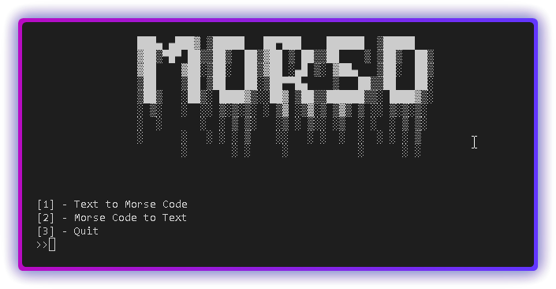

# 🔠 MorsO - Morse Code Converter



**MorsO** is a Python-based console application that converts English text to Morse code and vice versa. Built for speed, simplicity, and interactive use, it features a clean console-based UI and includes functionalities to save conversion results. Ideal for quick translations, basic cryptography, and learning Morse code.

---

## 📌 Features

- 🔁 **Bidirectional Conversion**:  
  Convert **English text to Morse code** and **Morse code to English text** with high accuracy.

- 🖥️ **Console UI**:  
  A clean and interactive command-line interface using Python's standard I/O functions and styled titles via the `console.utils` module.

- 💾 **Save Outputs**:  
  Option to save conversions to files (`text_to_morse.txt` or `morse_to_text.txt`) for later use.

- 🚀 **Fast Processing**:  
  Conversion logic is implemented using dictionary lookups, ensuring fast performance.

- 🧠 **Error Handling**:  
  Gracefully handles unsupported characters and invalid inputs with user-friendly messages.

- 🛠️ **Clean UI Design**:  
  Visual clarity through structured menu navigation and screen refresh using `os.system("cls")`.

---

## 🧑‍💻 How It Works

1. **Text to Morse**:  
   Input any English word or phrase (no spaces), and it will be converted into standard Morse code.

2. **Morse to Text**:  
   Input valid Morse code (symbols separated by spaces), and it will be translated back to English.

3. **Navigation**:  
   You can go back, exit the app, or save results from within the flow of the program.

---

---

## 📂 File Structure

```bash
main.py               # Core script to run the converter
text_to_morse.txt     # (auto-generated) Stores Morse outputs
morse_to_text.txt     # (auto-generated) Stores Text outputs
preview.png           # Screenshot of the console UI
install.bat           # Automatically install the requirements of program
requirements.txt      # All the required module / dependences 
```

---

## 🔮 Future Improvements

- 🌐 **Add GUI** for a more visual experience.  
- 🌈 **Support for Sentence Case & Punctuation Handling** in text input.  
- 🔠 **Decode words separated by "/" in Morse**.  
- 🔊 **Add sound output** (dot & dash beeps) for real-time Morse playback.  
- 🧪 **Unit Testing** to ensure reliability and maintainability.
- 📂 **Save as option** to save multiple files

---

## 🚀 How to Run

1. Clone the repository:
   ```bash
   git clone https://github.com/yourname/morso-morse-converter.git
   cd morso-morse-converter
   ```

2. Install dependencies :
   ```bash
   pip install -r requirements.txt
   ```
   OR use [install.bat](install.bat)

4. Run the script:
   ```bash
   python main.py
   ```

---

## 🧑‍🎓 Author

Created by **[AxwinX](https://github.com/AxwinX/)**  
For queries or contributions, feel free to open an issue or submit a pull request!
